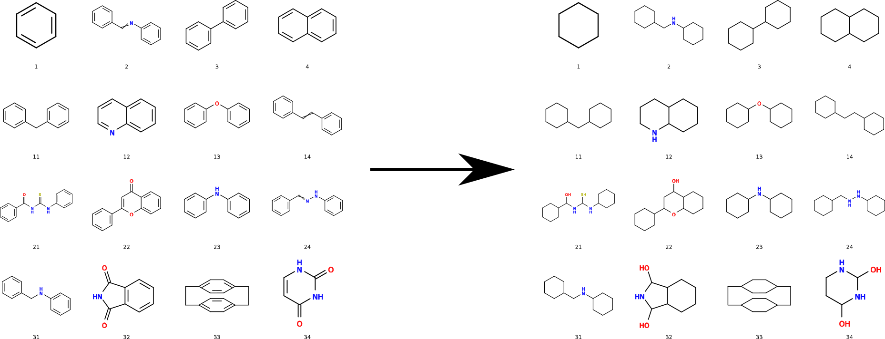
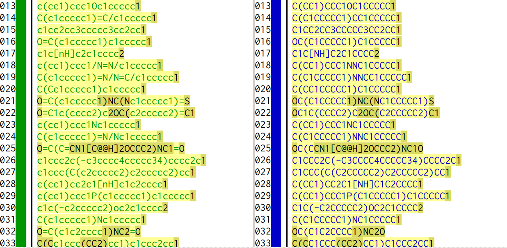

[](https://0dependencies.dev)

<a href="https://github.com/psf/black"></a>

  

# Background

The Bemis-Murcko scaffold[^1] provided by DataWarrior[^2] retains
information about bond order and chirality. Sometimes, however, it
suffices to retain only atom connectivity, like an assumption «there are
only single bonds». Note, DataWarrior equally offers the export of
Bemis-Murcko skeleton, however this simplifies e.g. the scaffold about
an imidazole into one of cyclopentane.



# Typical use

After the installation (see below), the script's general input follows
the pattern of

``` shell
saturate_murcko_scaffolds [-h] inputs [inputs ...]
```

Running from the CLI, this translates for example the SMILES strings
about pyridine and benzene to the ones about piperidine and cyclohexane

``` shell
$ saturate_murcko_scaffolds c1ccncc1 c1ccccc1
C1CCNCC1
C1CCCCC1
```

It equally is possible to provide the input as a list of SMILES in a
text file. As an example run in Linux Debian 13:

``` shell
$ cat test.smi
c1ccncc1
c1ccccc1
$ saturate_murcko_scaffolds test.smi
C1CCNCC1
C1CCCCC1
```

In a mixed input queue, SMILES strings provided via the CLI are
processed prior to SMILES provided via one, or multiple input file(s).
If wanted, the output to the CLI can be redirected to (piped into) the
input of the next command-line utility, or appended to an already
existing permanent record, for instance

``` shell
$ saturate_murcko_scaffolds test.smi > output.smi
$ cat output.smi 
C1CCNCC1
C1CCCCC1
```

# Installation

For normal use, download the most recent Python .whl enclosed in a zip
archive distributed on the [releases
page](https://github.com/nbehrnd/datawarrior_saturate_Murcko_scaffolds/releases).
Within e.g., an activated virtual environment, the installation proceeds
purely locally in the pattern of

``` bash
pip install saturate_murcko_scaffolds-1.3.1-py3-none-any.whl
```

Intentionally, the Python script and subsequent .whl are set up to work
regardless of the underlying operation system (Windows,[^3] Linux, or
MacOS) out of the box with the standard library of Python (version 3.10,
or higher).

You equally can clone the GitHub repository to then proceed by either
command of

``` bash
pip install .
pip install .e
```

Note (because of `pip`) this requires a working connection to the
internet during the installation.

If you are interested to locally edit and develop further the
application, `pyproject.toml` lists additional tools like `flake8` and
`pytest` distributed on the PyPI to check and improve source code
quality. Then, the command

``` bash
pip install pyproject.toml[dev]
```

resolves these dependencies. Finally, a GNU Makefile provides additional
analytic tools.

# Larger example

For a collection of organic materials, the Bemis-Murcko scaffolds were
extracted with DataWarrior (then release 5.0.0 for Linux, January 2019)
as listing `input.smi` including higher bond orders (see folder `demo`)
with a redirect of the output into file `input_sat.smi`. The effect of
the «artificial saturation» is easy to recognize while comparing the
scaffold lists (fig. <span class="spurious-link"
target="file_diff">*file_diff*</span>) in a difference view.

<figure id="file_diff" width="75%">

<figcaption>Difference view of the SMILES strings of a Murcko scaffold
<em>prior</em> (left hand column) and <em>after</em> an «artificial
saturation» (right hand column). The processing affects explicit bond
order indicators, e.g. double bond (equality sign, e.g., line #14),
triple bond bond (number sign <code>#</code>, not shown); or about
implicit aromatization (lower case to upper case) for atoms of carbon,
nitrogen, oxygen (depicted); or phosphorus, sulfur (not depicted).
Stereochemical indicators about double bonds will be removed (e.g.,
slashes in lines #18 and #19). Descriptors of stereogenic centers
(<code>@</code>-signs, e.g., line #25) and charges (not shown) are
copied verbatim.</figcaption>
</figure>

OpenBabel[^4] is used to illustrate the work of the script. The
instructions to the CLI follow the pattern of

``` shell
obabel -ismi test_input.smi -O test_input_color.svg -xc10 -xr12 -xl --addinindex
```

to generate a `.svg` file (vector representation), or

``` shell
obabel -ismi test_input_sat.smi -O test_input_sat_color.png -xc10 -xr12 -xl --addinindex -xp 3000
```

to generate a bitmap `.png` with structure formulae depicted in a grid
of 10 columns by 12 rows. Script `series.py` automates the generation of
the illustrations about both structure data sets.

It is remarkable how well OpenBabel's displays the molecular structures
with advanced motifs. In addition to those shown in the first
illustration of this guide, see sub-folder `test_data` for a more
extensive survey (e.g., the scaffold of cyclophane \[entry #33\],
sparteine \[#38\], or adamantane \[#50\]).

# Known peculiarities

The script provides «saturation» by dropping explicit information
related to double and triple bonds which SMILES encode (`=`, `#`
regarding bond order; `/` (forward slash), `\` (backward slash)
regarding (*cis*)-(*trans*) relationship around double bonds). While
processing double bonds of e.g., ketones to yield secondary alcohols,
the script refrains from the assignment of new CIP priorities and a
corresponding label. It then depends on the program used for a
visualization, if an explicit wedge is used (e.g., OpenBabel), or the
absence of information is highlighted (e.g., as question mark in
DataWarrior, or the project of CDK depict[^5]) as ambiguous. Absolute
configuration of stereogenic centers (indicated in SMILES with the `@`
sign) already assigned in the input however is retained.

For a selection of elements (C, N, O, P, S), the implicit description of
aromatic systems (e.g., as `c1ccncc1` in pyridine, `c1c[nH]cc1` in
pyrrol) is recognized. To offer a «saturation», these characters
returned as upper case characters to yield e.g., piperidine (`C1CCNCC1`)
and pyrrolidine (`C1C[NH]CC1`).

The script equally preserves up to one single negative, or single
positive charge of these five elements (e.g., `[O-]c1ccccc1` about the
phenolate anion, and `C[N+](c1ccccc1)(C)C` about
*N,N,N*-trimethylbenzenaminium cation). Here, it can be sensible to
«sanitize» the results this script provides by other libraries as e.g.
RDKit.[^6]

The capitalization of the five characters is constrained to prevent non
sensible transformations of e.g., an (implicitly) aromatic atom of tin
`[sn]` into the invalid form `[SN]`. Though the script is going to write
tin as `[Sn]`, an adjustment of valence for elements written with two
characters is beyond the current scope of the script.

A SMILES string may describe more than one molecule. Thus, the
concatenation with "`.`" (period character) as seen for example in
descriptions of co-crystals like about 1,4-benzoquinone and
hydroquinone, `C1=CC(=O)C=CC1=O.c1cc(ccc1O)O`, is retained. The example
is resolved as `C1CC(O)CCC1O.C1CC(CCC1O)O`.

# License

Norwid Behrnd, 2019, GPLv3.

# Footnotes

[^1]: Bemis, G. W.; Murcko, M. A. The Properties of Known Drugs. 1.
    Molecular Frameworks. *J. Med. Chem.* **1996**, *39*, 2887–2893
    (<https://doi.org/10.1021/jm9602928>).

[^2]: Sander, T.; Freyss, J.; Von Korff, M.; Rufener, C. DataWarrior: An
    Open-Source Program For Chemistry Aware Data Visualization And
    Analysis. *J. Chem. Inf. Model.* **2015**, *55*, 460–473
    (<https://doi.org/10.1021/ci500588j>). The program, (c) 2002–2024 by
    Idorsia Pharmaceuticals Ltd., is freely available under
    <http://www.openmolecules.org>. For the source code (GPLv3), see
    <https://github.com/thsa/datawarrior>.

[^3]: Contrasting to `cmd.exe`, Windows' PowerShell may block the
    execution of scripts. The later is adjustable by the command
    `set-executionpolicy remotesigned` while running in the
    administrator mode. For additional details, visit for instance [How
    to enable execution of PowerShell
    scripts?](https://superuser.com/questions/106360/how-to-enable-execution-of-powershell-scripts)
    on StackExchange/superuser.

[^4]: <https://github.com/openbabel/openbabel> For the most recent
    documentation, see <https://open-babel.readthedocs.io/en/latest/>

[^5]: <https://www.simolecule.com/cdkdepict/depict.html> For the
    mentioned annotation of CIP labels, change `No Annotation` (second
    pull down menu from the left) to `CIP Stereo Label`.

[^6]: For an overview about the freely available RDKit library, see
    [www.rdkit.org](https://www.rdkit.org/). An introduction into the
    topic of «molecular sanitization» is provided in the section of this
    very title in the on-line
    [RDKit Book](https://www.rdkit.org/docs/RDKit_Book.html).
